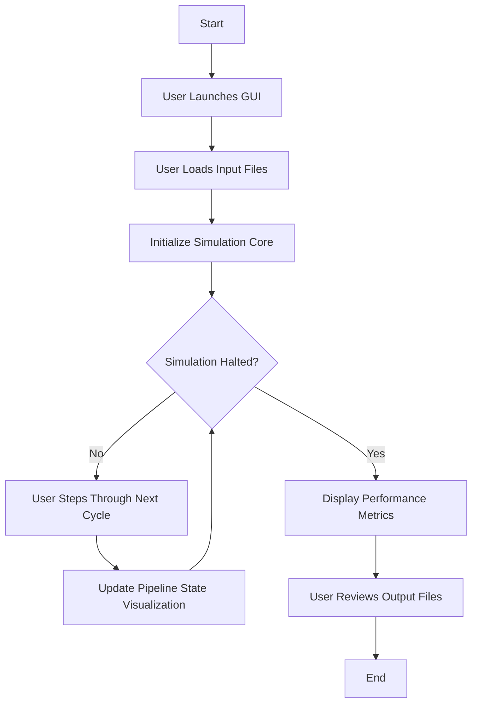

# GUI-Based Workflow Flowchart for RISC-V 5-Stage Pipeline Simulator

## Description
- **User Launches GUI:** The user starts the Tkinter-based GUI application.
- **Load Input Files:** The user selects a folder containing `imem.txt` and `dmem.txt`.
- **Initialize Simulation Core:** The simulator core is set up with the loaded files.
- **Cycle-by-Cycle Execution:** The user clicks "Next Cycle" to advance the simulation. After each cycle, the pipeline state is updated in the GUI.
- **Halting Condition:** When the simulation halts (HALT instruction processed), the GUI displays performance metrics.
- **Review Output:** The user can review output files generated in the input folder.

This flowchart captures the interactive, user-driven nature of the GUI-based simulation, focusing on single-core operation and real-time visualization. 
